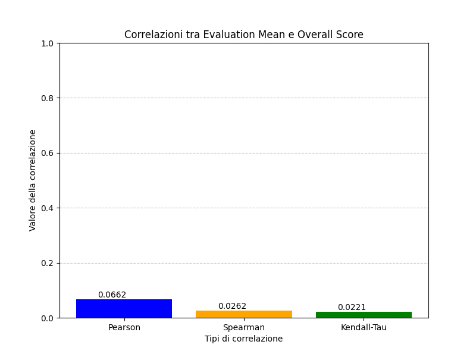

# **G-EVAL: Valutazione Avanzata della Qualità dei Dialoghi**

[](https://www.python.org/)

G-EVAL è un framework avanzato per la valutazione automatica della qualità dei dialoghi generati utilizzando metriche basate su modelli di linguaggio di grandi dimensioni (LLM). Questo repository offre strumenti per l'analisi di dataset, il calcolo delle metriche e la generazione di visualizzazioni dei risultati.

---

## **Caratteristiche Principali**
- 🚀 **Valutazione Multi-Livello**: Supporta sia valutazioni a livello di turno (turn-level) che di dialogo completo (dialog-level).
- 📊 **Analisi Completa**: Generazione di correlazioni, grafici di distribuzione e heatmap per analisi approfondite.
- 🛠️ **Altamente Personalizzabile**: Possibilità di utilizzare template personalizzati per diverse modalità di valutazione.
- 📂 **Dataset Supportati**: Include integrazione con i dataset FED e TC_USR.

---

## **Installazione**

1. Clona il repository:
   ```bash
   git clone https://github.com/tuo-username/g-eval.git
   cd g-eval
   ```

2. Installa le dipendenze:
   ```bash
   pip install -r requirements.txt
   ```

3. Configura la tua API key (se necessario):
   - Crea un file `.env` nella directory principale.
   - Aggiungi la tua chiave API:
     ```
     OPENAI_API_KEY=la_tua_chiave_api
     ```

---

## **Dataset**
- **FED**: Feedback Evaluation Dataset per dialoghi open-domain.
- **TC_USR**: Dataset focalizzato su dialoghi con valutazioni di engagingness e naturalness.
- **PC_USR**: Dialoghi basati su informazioni di fatto.
- **DSTC9**: Benchmark per il dialogo multi-turno.
- **CONVAI2**: Dataset per la generazione di dialoghi open-domain.

Assicurati che i dataset siano salvati nella cartella `datasets/`.

---

## **Parametri**

I parametri utilizzati nello script sono i seguenti:

- `--mode`: Specifica la modalità di esecuzione (fed, tc_usr, pc_usr, dstc, convai, result).
- `--input_file`: Percorso del file di input contenente i dati da valutare.
- `--single_template_path`: Percorso del prompt template per la valutazione di singole risposte.
- `--full_template_path`: Percorso del prompt template per la valutazione di dialoghi completi.
- `--output_file`: Percorso del file di output dove verranno salvati i risultati.
- `--num_records`: Numero di record da valutare. Utilizzato per limitare il numero di valutazioni eseguite.

---

## **Modalità di Esecuzione**

### 1. **Valutazione del Dataset FED**
Esegui la valutazione di un sottoinsieme del dataset FED:
```bash
python main.py --mode fed --input_file datasets/fed_data.json \
--single_template_path prompts/fed_single_response.txt \
--full_template_path prompts/fed_full_dialogue.txt \
--output_file results/fed_results.json --num_records 2
```

### 2. **Valutazione del Dataset TC_USR**
Esegui la valutazione di un sottoinsieme del dataset TC_USR:
```bash
python main.py --mode tc_usr --input_file datasets/tc_usr_data.json \
--single_template_path prompts/tc_usr_single_response.txt \
--output_file results/tc_usr_results.json --num_records 2
```

### 3. **Valutazione del Dataset PC_USR**
Esegui la valutazione di un sottoinsieme del dataset PC_USR:
```bash
python main.py --mode pc_usr --input_file datasets/pc_usr_data.json \
--single_template_path prompts/pc_usr_single_response.txt \
--output_file results/pc_usr_results.json --num_records 2
```

### 4. **Valutazione del Dataset DSTC**
Esegui la valutazione di un sottoinsieme del dataset DSTC:
```bash
python main.py --mode dstc --input_file datasets/dstc9_data.json \
--full_template_path prompts/dstc_full_dialogue.txt \
--output_file results/dstc_results.json --num_records 2
```

### 5. **Valutazione del Dataset CONVAI**
Esegui la valutazione di un sottoinsieme del dataset CONVAI:
```bash
python main.py --mode convai --input_file datasets/convai2_data.json \
--full_template_path prompts/convai_full_dialogue.txt \
--output_file results/convai_results.json --num_records 2
```

### 3. **Analisi dei Risultati**
Analizza i risultati di una valutazione completata e genera visualizzazioni:
```bash
python main.py --mode result --input_file results/fed_results.json \
--output_file results/analysis/
```

---

## **Struttura del Repository**

- `datasets/`: Contiene i dataset di input (es. FED, TC_USR).
- `prompts/`: Template per i prompt di valutazione.
- `results/`: Output delle valutazioni e analisi.
- `main.py`: Script principale per eseguire le valutazioni e analisi.
- `evaluators/`: Moduli per il preprocessing e la valutazione dei dati.

---

## **Esempi di Output**
### Grafici Generati
#### FED Turn-Level


#### FED Dialog-Level


---

## **Contatti**
Per domande o suggerimenti:
- Email: **s.sirica2000@gmail.com**
- LinkedIn: **[Salvatore Sirica](https://www.linkedin.com/in/salvatore-sirica-823325208/)**

---
